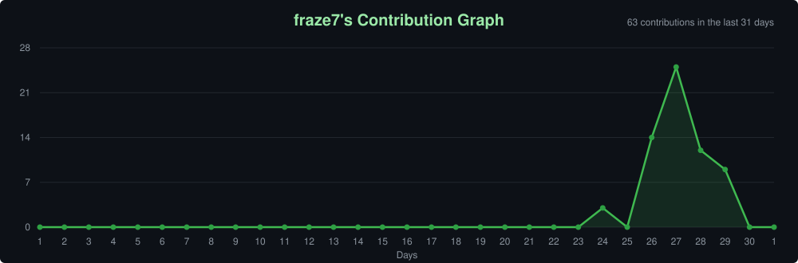

<h1>Hi, I'm Frazer!</h1>
<h3>Full-Stack Developer &nbsp;•&nbsp; Front-End Developer &nbsp;•&nbsp; Back-End Developer &nbsp;•&nbsp; Cloud Developer</h3>

Building web applications from front to back — HTML, CSS, JavaScript, React, Python, SQL, and Cloud.

<h2>About Me</h2>
<table>
  <tr>
    <td width="65%">
    
I am an aspiring <strong>Full-Stack Developer</strong> with a passion for building clean, performant, and user-friendly web applications that solve real-world problems.

    <h3>My primary interests include:</h3>
    <ul>
      <li>Front-End Development (HTML, CSS, JavaScript, React.js)</li>
      <li>Back-End Development (Python, SQL, Node.js)</li>
      <li>Cloud Computing (AWS, Microsoft Azure)</li>
      <li>Version Control (Git & GitHub)</li>
      <li>Responsive & Accessible Web Design</li>
      <li>Database Design & Management</li>
      <li>Full-Stack Application Architecture</li>
      <li>DevOps & Deployment</li>
    </ul>
    
I enjoy turning ideas into working applications while continuously building my skills through real projects.

    </td>
    <td width="35%" align="center">
      <!-- Replace with your profile picture URL (e.g. from LinkedIn) -->
      
    </td>
  </tr>
</table>
<h2>Full-Stack Technology Stack</h2>
<h3>Languages</h3>

  
  
  
  
  

<h3>Front-End</h3>

  
  
  
  

<h3>Back-End & Databases</h3>

  
  
  
  

<h3>Cloud & DevOps</h3>

  

<h2>Full-Stack Skills</h2>

<table>
  <tr>
    <th align="center">Front-End</th>
    <th align="center">Back-End & Data</th>
    <th align="center">Cloud & Tooling</th>
  </tr>
  <tr>
    <td>
      <ul>
        <li>HTML5 Semantics</li>
        <li>CSS3 & Tailwind</li>
        <li>SASS / Preprocessors</li>
        <li>JavaScript (ES6+)</li>
        <li>React.js & Hooks</li>
        <li>Responsive Design</li>
        <li>Canvas API</li>
      </ul>
    </td>
    <td>
      <ul>
        <li>Python Scripting</li>
        <li>SQL & Databases</li>
        <li>Command Line / CLI</li>
        <li>REST Principles</li>
        <li>Data-Driven Apps</li>
        <li>GitHub & Version Control</li>
        <li>Portfolio Deployment</li>
      </ul>
    </td>
    <td>
      <ul>
        <li>AWS Fundamentals</li>
        <li>Microsoft Azure</li>
        <li>Git Workflow</li>
        <li>VS Code</li>
        <li>Netlify / Static Hosting</li>
        <li>GitHub Pages</li>
        <li>Cloud Security Basics</li>
      </ul>
    </td>
  </tr>
</table>

<h2>Featured Projects</h2>
<table>
  <tr>
    <td colspan="2">
      <h3>Clutch Gear — Full-Stack E-Commerce Store</h3>
      

      An online store for a made-up gaming gear brand, with a product catalogue, a shopping cart and working Stripe checkout (test mode) backed by a Postgres database. Tested with Vitest and checked by GitHub Actions CI on every change. <i>In progress.</i>
      

      <b>Stack:</b> Next.js · TypeScript · Tailwind CSS · PostgreSQL · Prisma · Stripe · Vitest · GitHub Actions · Vercel
       
      <a href="https://clutch-gear.vercel.app">Live Site →</a> &nbsp;·&nbsp; <a href="https://github.com/fraze7/clutch-gear">Source Code →</a>
    </td>
  </tr>
  <tr>
    <td width="50%">
      <h3>CS2 Skin Browser</h3>
      

      A React app for browsing live CS2 skin listings from the CSFloat marketplace, built around custom hooks and live API data.
      

      <b>Stack:</b> React · JavaScript · CSS · Vite · Vercel Serverless Functions
       
      <a href="https://cs2-skin-browser.vercel.app">Live Site →</a> &nbsp;·&nbsp; <a href="https://github.com/fraze7/cs2-skin-browser">Source Code →</a>
    </td>
    <td width="50%">
      <h3>Money Builder</h3>
      

      A compound interest calculator: enter your investment details and see your projected returns year by year.
      

      <b>Stack:</b> React · JavaScript · Vite
       
      <a href="https://moneybuilderapp.vercel.app">Live Site →</a> &nbsp;·&nbsp; <a href="https://github.com/fraze7/moneybuilderapp">Source Code →</a>
    </td>
  </tr>
</table>
<h2>Currently Learning</h2>
<table>
  <tr>
    <td>
      <ul>
        <li>React.js — Advanced patterns & hooks</li>
        <li>Python back-end development</li>
        <li>SQL database design</li>
      </ul>
    </td>
    <td>
      <ul>
        <li>GitHub — Branching strategies & CI/CD</li>
        <li>AWS Cloud Practitioner certification</li>
        <li>Microsoft Azure fundamentals</li>
      </ul>
    </td>
    <td>
      <ul>
        <li>Full-stack project architecture</li>
        <li>API design & integration</li>
        <li>Deployment & cloud hosting</li>
      </ul>
    </td>
  </tr>
</table>
<h2>GitHub Analytics</h2>

  

<h3>Activity Graph</h3>

  

<h3>Visitor Count</h3>

  

  <strong>"The best developers are those who never stop building, never stop learning, and never stop shipping."</strong>

  Studied the <a href="https://itonlinelearning.com/course/coding-diploma/">Coding Diploma</a> at <a href="https://itonlinelearning.com">ITonlinelearning</a> BCS Tech10 Accredited

